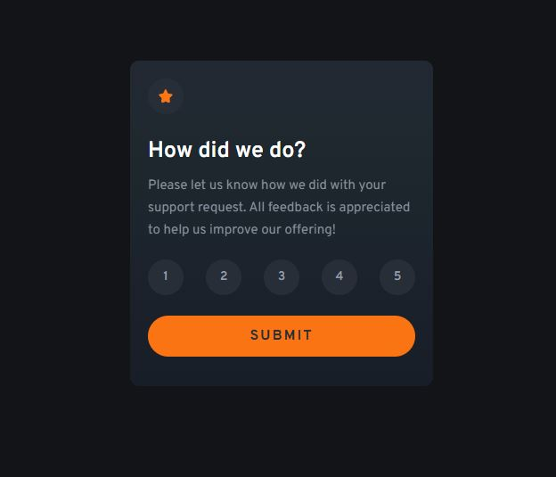
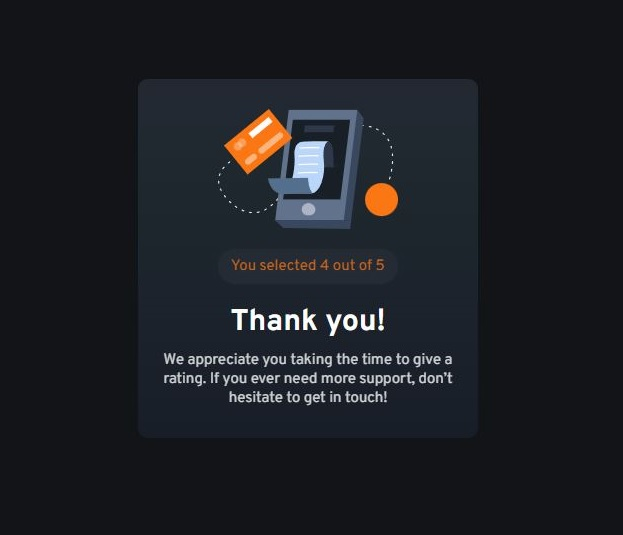

# Frontend Mentor - Interactive rating component solution

This is a solution to the [Interactive rating component challenge on Frontend Mentor](https://www.frontendmentor.io/challenges/interactive-rating-component-koxpeBUmI). Frontend Mentor challenges help you improve your coding skills by building realistic projects.

## Table of contents

- [Overview](#overview)
  - [The challenge](#the-challenge)
  - [Screenshot](#screenshot)
  - [Links](#links)
- [My process](#my-process)
  - [Built with](#built-with)
  - [What I learned](#what-i-learned)
- [Author](#author)

**Note: Delete this note and update the table of contents based on what sections you keep.**

## Overview

### The challenge

Users should be able to:

- View the optimal layout for the app depending on their device's screen size
- See hover states for all interactive elements on the page
- Select and submit a number rating
- See the "Thank you" card state after submitting a rating

### Screenshot

## My process

### Built with

- Semantic HTML5 markup
- CSS custom properties
- Flexbox
- CSS Grid
- Mobile-first workflow
- Plain Javascript

### What I learned

This challenge involved using plain Javascript to switch the views inside the card after pressing submit. I did this by toggling a class called "hidden-card" between the two views. Although this wasn't very difficult to implement (and doesn't seem very efficient), it provided a good intro to using plain JS in web development. I also learned about the DOM and how it works as well as how to manipulate it to make dynamic changes to the webpage. In the future I hope to learn and use React instead.

With regards to CSS, at this point I have a pretty good understanding of how to make elements look similar to the provided design. The only thing I struggled with is creating the color gradient in the background of the component. After lots of playing around in [cssgradient.io](https://cssgradient.io/) the color is still not quite the same.

## Author

- Frontend Mentor - [@filipangel](https://www.frontendmentor.io/profile/filipangel)
